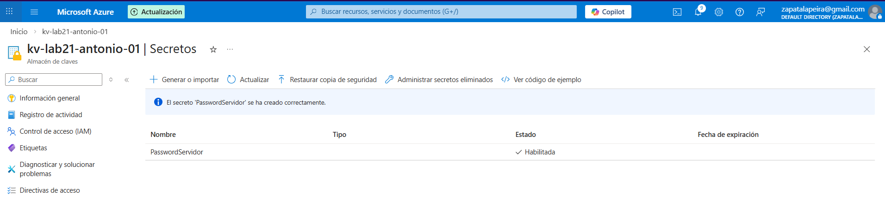
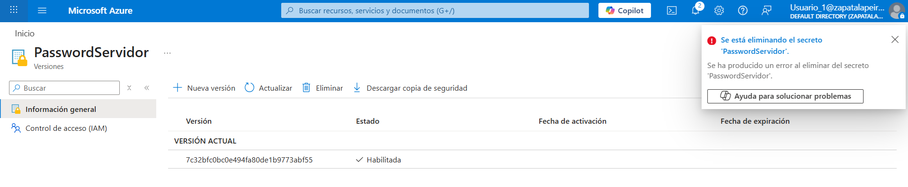

# Lab 21 – Azure Key Vault – Protección de secretos

## Objetivo
Centralizar y proteger credenciales en Azure usando Key Vault, evitando contraseñas en texto plano y aplicando mínimo privilegio (leer sí, borrar no).

---

## Qué he hecho en este laboratorio

1. He creado un Azure Key Vault para almacenar secretos de forma segura.
2. He creado un secreto llamado `PasswordServidor`.
3. He configurado permisos para que mi usuario pueda leer el secreto, pero no pueda eliminarlo.

---

## Arquitectura y concepto

Key Vault es un servicio de Azure para gestionar secretos (contraseñas, claves, tokens) de forma centralizada y controlada.

La idea es:
- Guardar credenciales en un único sitio seguro.
- Controlar el acceso mediante permisos (RBAC / políticas).
- Evitar que las aplicaciones o scripts usen contraseñas “hardcodeadas”.

---

## Configuración utilizada

- Key Vault: `kv-lab21-antonio-01`
- Secreto: `PasswordServidor`
- Control de acceso: Azure RBAC (permiso de lectura sin permiso de borrado)

---

## Validación funcional

Se ha comprobado que el secreto existe y se puede leer con el usuario configurado.
Además, se ha verificado que el borrado del secreto no está permitido (mínimo privilegio).

---

## Evidencias

### 01 – Secreto creado en Key Vault

Se muestra el secreto `PasswordServidor` dentro de la lista de secretos del Key Vault.

---

### 02 – Borrado denegado 

Se muestra el intento de eliminar el secreto y el error por falta de permisos.

---

## Checklist de verificación

- [x] Key Vault creado
- [x] Secreto `PasswordServidor` creado
- [x] Mi usuario puede leer el secreto
- [x] Mi usuario no puede eliminar el secreto

---

## Qué le diría a un cliente o en entrevista

“Guardo secretos en Key Vault para no usar credenciales en texto plano. Asigno permisos mínimos: lectura para quien lo necesita y bloqueo operaciones destructivas como el borrado. Así reduzco riesgos y centralizo la seguridad de credenciales.”

---

